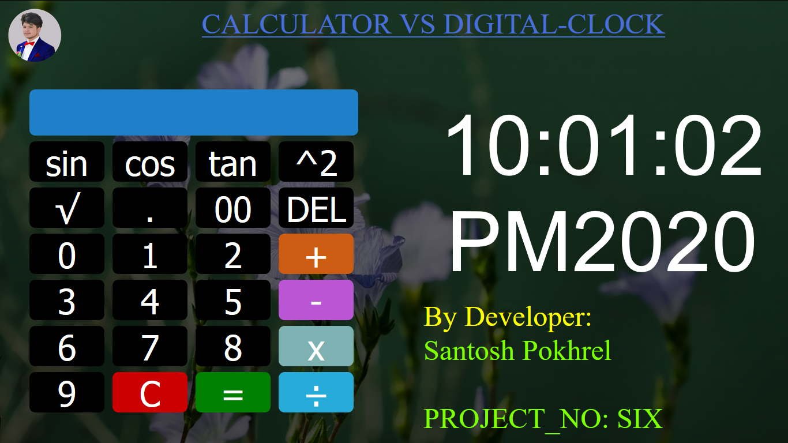

# __Scientific Calculator Using JavaScript__
* Hey guys I develop this app using javascript for acutal functionalities and html,css for styling and markup part...hope you guys like it.

---
### Requirements
  * Knowledge of html5/css3.
  * basic knowledge of JavaScript.
  * you can use any text editor to edit this website.
  * you can contribute by adding more function to this app if you want.
  * clone this project and run the index.html file

### Sample
  
  

> __Thnank you so much guys...__